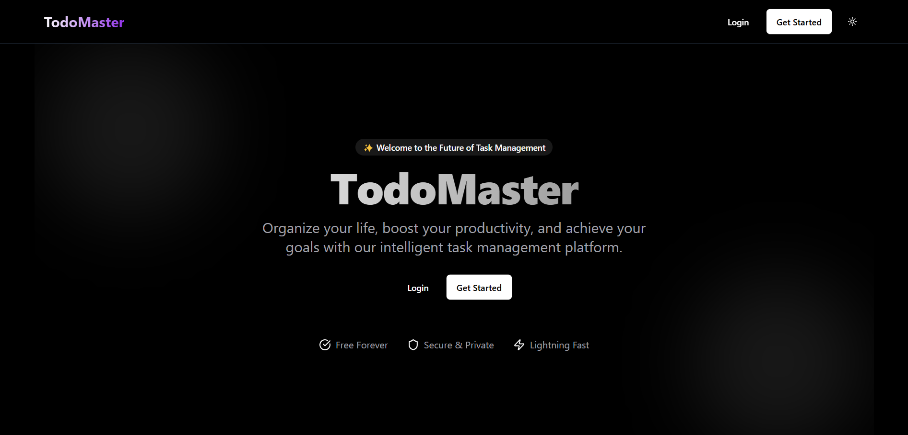

# 🚀 Todo App with React, TypeScript, Supabase, and Tanstack Query

This is a full-featured Todo application built with **React**, **TypeScript**, **Supabase** (for the backend), **Tanstack Query** (for data fetching and state management, and caching), and **Shadcn/UI** (for UI components). It allows users to create, update, delete, and manage their tasks with features like pagination, sorting by date, and filtering by status.



## ✨ Features

- 📝 **Create Todos**: Add new tasks with a title and optional description.
- 🔄 **Update Todos**: Edit task details or mark them as completed.
- 🗑️ **Delete Todos**: Remove tasks from the list.
- 📄 **Pagination**: View todos in chunks with configurable page sizes (10, 50, or 100 per page).
- ⏱️ **Sorting by Date**: Sort tasks by creation date (latest or oldest).
- 🔍 **Filtering by Status**: Filter tasks to show all, active (incomplete), or completed todos.
- ⚡ **Real-time Data**: Powered by Supabase for persistent storage and retrieval.
- 📱 **Responsive UI**: Built with Tailwind CSS and Shadcn/UI components for a modern, clean look.
- 🛡️ **Type Safety**: Written in TypeScript for robust code and better developer experience.

## 📁 Project Structure

```
todo-app/
├── src/
│   ├── components/
│   │   ├── auth/           # Authentication components
│   │   │   ├── LoginForm.tsx
│   │   │   ├── RegisterForm.tsx
│   │   │   └── ProtectedRoute.tsx
│   │   ├── common/         # Reusable components
│   │   │   ├── DrawerDialogDemo.tsx
│   │   │   ├── PaginationSchema.tsx
│   │   │   ├── Spinner.tsx
│   │   │   └── Toaster.tsx
│   │   ├── layout/         # Layout components
│   │   │   ├── Footer.tsx
│   │   │   ├── Header.tsx
│   │   │   └── MainLayout.tsx
│   │   ├── todo/           # Todo feature components
│   │   │   ├── TodoApp.tsx
│   │   │   ├── TodoForm.tsx
│   │   │   ├── TodoItem.tsx
│   │   │   └── TodoList.tsx
│   │   └── ui/             # Shadcn/UI components
│   │       ├── button.tsx
│   │       ├── checkbox.tsx
│   │       ├── dialog.tsx
│   │       ├── drawer.tsx
│   │       ├── input.tsx
│   │       ├── label.tsx
│   │       ├── pagination.tsx
│   │       ├── select.tsx
│   │       ├── sonner.tsx
│   │       └── textarea.tsx
│   ├── context/           # Context providers
│   │   ├── Auth/          # Authentication context
│   │   │   ├── AuthContext.tsx
│   │   │   ├── authTypes.ts
│   │   │   └── useAuth.ts
│   │   ├── Theme/         # Theme context
│   │   │   ├── ThemeContext.tsx
│   │   │   ├── themeTypes.ts
│   │   │   └── useTheme.ts
│   ├── hooks/             # Custom hooks
│   │   ├── use-media-query.tsx
│   │   └── useTodoQuery.ts
│   ├── lib/               # Utility libraries
│   │   ├── api.ts         # API functions for Supabase
│   │   ├── supabase.ts    # Supabase client initialization
│   │   └── utils.ts       # Utility functions
│   ├── pages/             # Application pages
│   │   ├── HomePage.tsx
│   │   ├── NotFound.tsx
│   │   └── ProfilePage.tsx
│   ├── styles/            # Global styles
│   │   └── globals.css
│   ├── types/             # TypeScript types
│   │   ├── auth.ts
│   │   └── todos.ts
│   ├── utils/             # Utility functions
│   │   ├── auth.ts
│   │   └── routeUtils.ts
│   ├── App.tsx            # Root application component
│   ├── main.tsx           # Application entry point
│   └── vite-env.d.ts      # Vite environment types
├── public/                # Static assets
├── components.json        # Shadcn/UI components config
├── package.json           # Project dependencies and scripts
├── tailwind.config.js     # Tailwind CSS configuration
├── tsconfig.json          # TypeScript configuration
└── vite.config.ts         # Vite configuration
```

## 🔧 Prerequisites

Before setting up the project, ensure you have the following installed:
- 📦 **Node.js** (v18 or later) and **npm** (or **yarn**)
- 🔄 **Git** (to clone the repository)
- 🗄️ A **Supabase** account (free tier is sufficient)

## 🚀 Setup Guide

### 1. 📥 Clone the Repository
```bash
git clone https://github.com/nourmohamed45/simple-to-do-app.git
cd simple-to-do-app
```

### 2. 📦 Install Dependencies
Install the required Node.js packages:
```bash
npm install
```
Or, if using Yarn:
```bash
yarn install
```

### 3. 🗄️ Set Up Supabase
Supabase provides the backend database for storing todos. Follow these steps:

#### a. Create a Supabase Project
1. Go to [Supabase Dashboard](https://supabase.com/dashboard) and sign in or create an account.
2. Click **New Project**, choose a name (e.g., `todo-app`), and select a region.
3. Wait for the project to initialize (this may take a minute).

#### b. Create the `todos` Table
1. In your Supabase project, go to the **SQL Editor** (left sidebar).
2. Run the following SQL to create the `todos` table:
   ```sql
   CREATE TABLE todos (
     id SERIAL PRIMARY KEY,
     user_id UUID NOT NULL,
     title TEXT NOT NULL,
     description TEXT,
     completed BOOLEAN DEFAULT FALSE,
     created_at TIMESTAMP WITH TIME ZONE DEFAULT NOW(),
     updated_at TIMESTAMP WITH TIME ZONE DEFAULT NOW()
   );
   ```
3. Click **Run** to execute the query.

#### c. Enable Row-Level Security (RLS)
Supabase uses RLS to secure data. For simplicity, let's allow authenticated users to access their own todos:
1. Go to **Authentication > Policies** in the Supabase dashboard.
2. Click **New Policy** for the `todos` table.
3. Use this policy to allow users to access their own data:
   - **Name**: `Users can access their own todos`
   - **Target Roles**: `authenticated`
   - **Policy Definition**:
     ```sql
     (auth.uid() = user_id)
     ```
   - Enable for **SELECT**, **INSERT**, **UPDATE**, and **DELETE**.
4. Save the policy.

#### d. Get Supabase Credentials
1. Go to **Settings > API** in your Supabase project.
2. Copy the **URL** and **anon key** (under "Project API keys").

### 4. ⚙️ Configure the Supabase Client
Create a file `src/lib/supabase.ts` with the following content:
```tsx
import { createClient } from '@supabase/supabase-js';

const supabaseUrl = 'YOUR_SUPABASE_URL'; // Replace with your Supabase URL
const supabaseAnonKey = 'YOUR_ANON_KEY'; // Replace with your anon key

export const supabase = createClient(supabaseUrl, supabaseAnonKey);
```
Replace `YOUR_SUPABASE_URL` and `YOUR_ANON_KEY` with the values from Step 3d.

### 5. 🔐 Set Up Authentication (Optional)
This app assumes a user is stored in `localStorage`. For a full auth flow:
1. Enable **Email Authentication** in Supabase (**Authentication > Providers**).
2. Add login/signup logic (e.g., using Supabase's auth methods) and store the user in `localStorage`:
   ```tsx
   const { user } = await supabase.auth.signInWithPassword({ email, password });
   localStorage.setItem("user", JSON.stringify(user));
   ```
For simplicity, you can manually set a `user` in `localStorage`:
```tsx
localStorage.setItem("user", JSON.stringify({ id: "your-supabase-user-id" }));
```
To get a user ID, sign up a test user in Supabase and copy their `id` from the `auth.users` table.

### 6. 🏃‍♂️ Run the Project
Start the development server:
```bash
npm run dev
```
Or with Yarn:
```bash
yarn dev
```
Open `http://localhost:5173` (or the port shown in your terminal) in your browser.

---

## 📱 How to Use the App

1. ➕ **Add a Task**:
   - Enter a title and optional description in the form.
   - Press **Enter** or click **Add Task**.

2. ✏️ **Edit a Task**:
   - (Assumes `TodoItem.tsx` has edit functionality—implement if needed.)
   - Update the title, description, or toggle completion.

3. 🗑️ **Delete a Task**:
   - (Assumes `TodoItem.tsx` has a delete button—implement if needed.)
   - Click the delete button to remove a task.

4. 🔍 **Filter by Status**:
   - Click **All**, **Active**, or **Completed** buttons to filter tasks.

5. ⏱️ **Sort by Date**:
   - Use the "Sort by date" dropdown to switch between **Latest** and **Oldest**.

6. 📄 **Change Page Size**:
   - Use the "Records per page" dropdown to set 10, 50, or 100 todos per page.

7. 📱 **Navigate Pages**:
   - Use the pagination controls at the bottom to move between pages.

---

## 🛠️ Key Technologies

- ⚛️ **React**: Frontend library for building the UI.
- 🔷 **TypeScript**: Adds static typing for better code quality.
- 🗄️ **Supabase**: Backend-as-a-Service for database and authentication.
- 🔄 **Tanstack Query**: Manages data fetching, caching, and mutations.
- 🎨 **Shadcn/UI**: Pre-built, customizable UI components with Tailwind CSS.

---

## 📦 Project Details

### 🔄 `useTodoQuery.ts`
- A custom hook that handles all todo-related logic:
  - Fetches todos with `useQuery`.
  - Manages state for pagination (`page`, `pageSize`), sorting (`sortOrder`), and filtering (`statusFilter`).
  - Provides mutation functions (`addTodo`, `updateTodo`, `deleteTodo`).

### 🔌 `api.ts`
- Contains functions to interact with Supabase:
  - `createTodo`, `getTodos`, `updateTodo`, `deleteTodo`.
  - Filters todos by user ID and status, sorts by date, and paginates results.

### 📱 `TodoApp.tsx`
- The root component that ties `TodoForm` and `TodoList` together, passing down props from `useTodoQuery`.

### 📝 `TodoForm.tsx`
- Handles task creation and provides controls for filtering, sorting, and page size.

### 📋 `TodoList.tsx`
- Displays the list of todos with pagination.

---

## ❗ Troubleshooting

- 🔄 **Todos Not Loading**: Check `supabase.ts` for correct URL and anon key. Ensure `user` is in `localStorage`.
- 🔷 **TypeScript Errors**: Verify types in `types/todos.ts` match your Supabase schema.
- 📄 **Pagination Issues**: Ensure `pageSize` and `totalCount` are correctly calculated.
- 🗄️ **Supabase Errors**: Check the browser console and Supabase logs for details.

---

## 📚 Next Steps for Learners

1. 🔐 **Add Authentication**: Implement a login/signup flow with Supabase Auth.
2. ✨ **Enhance TodoItem**: Add edit and delete buttons to each todo.
3. ⚡ **Real-Time Updates**: Use Supabase's real-time subscriptions to update the UI when todos change.
4. 🎨 **Styling**: Customize the Shadcn/UI components with Tailwind CSS.
5. 🛡️ **Error Handling**: Add more robust error messages and loading states.

---

## 🤝 Contributing

Feel free to fork this repository, make improvements, and submit pull requests. For questions, open an issue or reach out!

---

## 📜 License
This project is licensed under the MIT License. See the [LICENSE](LICENSE) file for details.

## 📧 Contact

Nour Elagwany - [@LinkedIn](https://www.linkedin.com/in/nour-mohamed-935b881b1/) - nour.mohamed.elagwany@gmail.com

Happy learning and coding! 🚀
